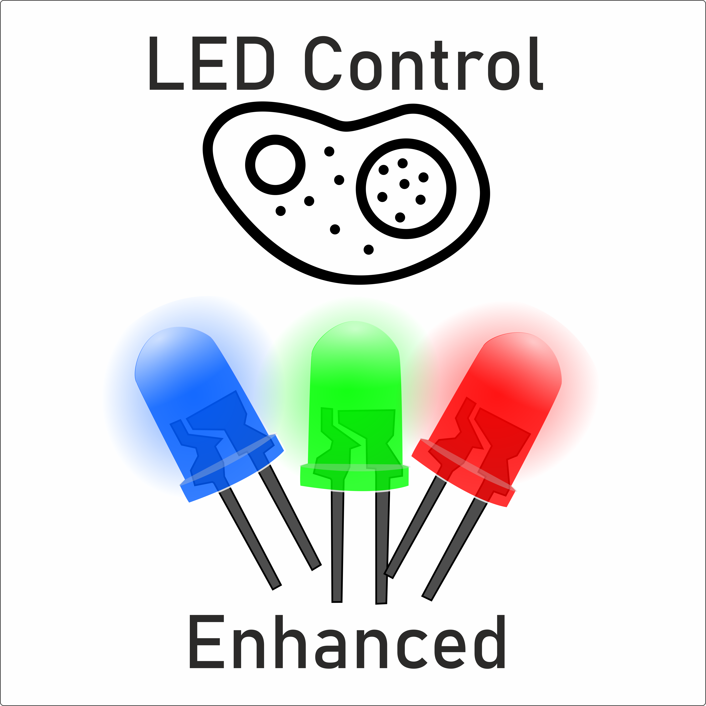

# EnhancedLEDControl

A MATLAB-based application for controlling and managing LED illumination systems, particularly designed for FRET (Förster Resonance Energy Transfer) microscopy and other fluorescence imaging applications.

## Overview

EnhancedLEDControl provides an intuitive graphical interface for precise control of multi-LED setups, enabling researchers to manage complex illumination sequences for fluorescence microscopy experiments.

## Features

- Graphical user interface built with MATLAB App Designer
- Multi-LED configuration and control
- Customizable illumination sequences
- Settings persistence through CSV configuration files
- Support for various LED types and wavelengths
- Real-time LED parameter adjustment

## Requirements

- MATLAB (R2016b or later recommended)
- MATLAB Runtime (for standalone installation)

## Installation

### Option 1: Using MATLAB
1. Clone this repository or download the source files
2. Open `Fret_Software.mlapp` in MATLAB
3. Run the application directly from MATLAB App Designer

### Option 2: Standalone Installation
1. Navigate to the `Installer` directory
2. Run the installer package for your platform
3. The installer will include the required MATLAB Runtime components

## Files

- `Fret_Software.mlapp` - Main application file
- `LED_list.csv` - LED configuration and database
- `Settings.csv` - Application settings and preferences
- `FRETSoftwarePatch3.prj` - MATLAB project file
- `EnhancedLEDControl_manual.pdf` - Comprehensive user manual

## Usage

1. Launch the application
2. Configure your LED setup using the LED list
3. Adjust illumination parameters as needed
4. Save your configuration for future sessions

For detailed instructions, please refer to the [user manual](EnhancedLEDControl_manual.pdf).

## Configuration Files

### LED_list.csv
Contains the list of available LEDs with their specifications (wavelengths, power settings, etc.)

### Settings.csv
Stores application preferences and default parameters

## Documentation

Complete documentation is available in `EnhancedLEDControl_manual.pdf`, including:
- Setup instructions
- LED configuration guidelines
- Troubleshooting tips
- Advanced features

## License

Please refer to the repository license file for usage terms and conditions.

## Contributing

Contributions, bug reports, and feature requests are welcome. Please open an issue or submit a pull request.

## Contact

For questions or support, please open an issue on GitHub.
